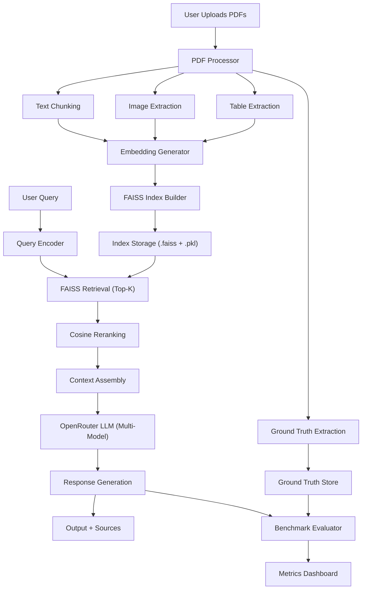
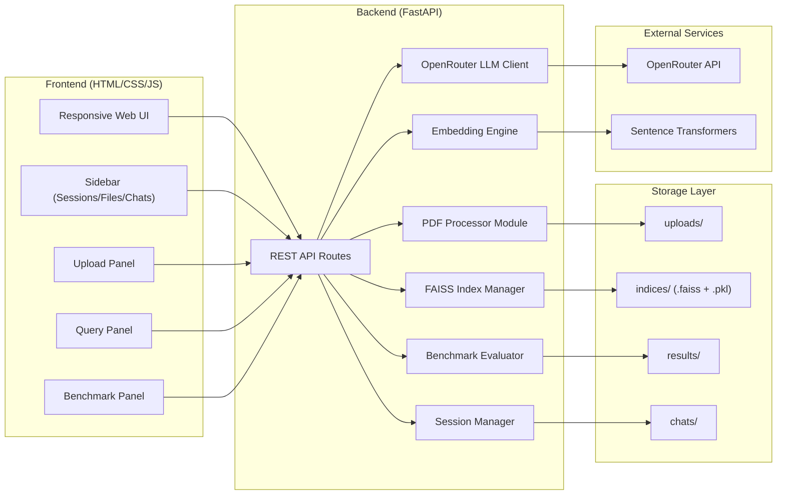
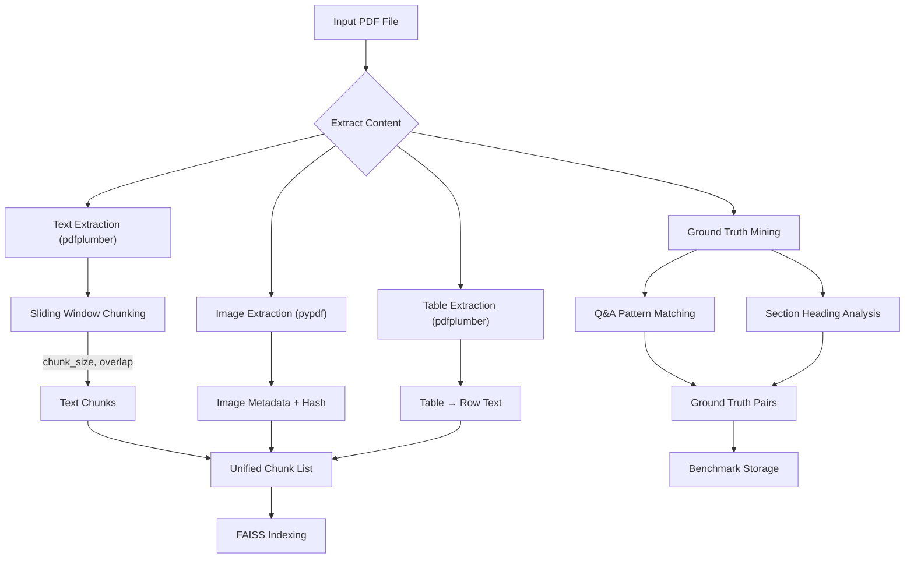
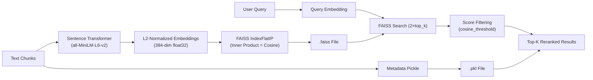
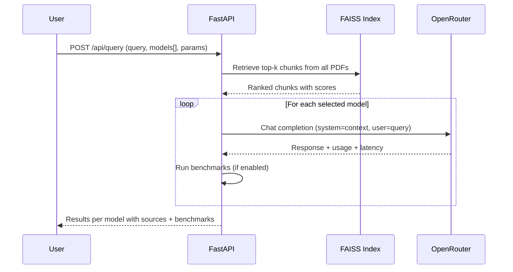
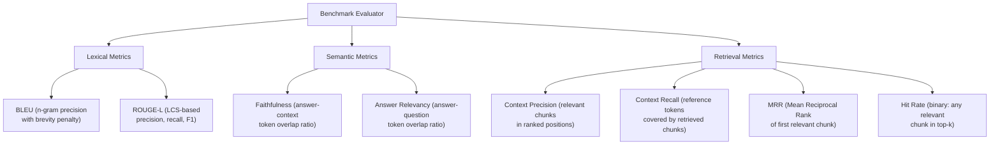
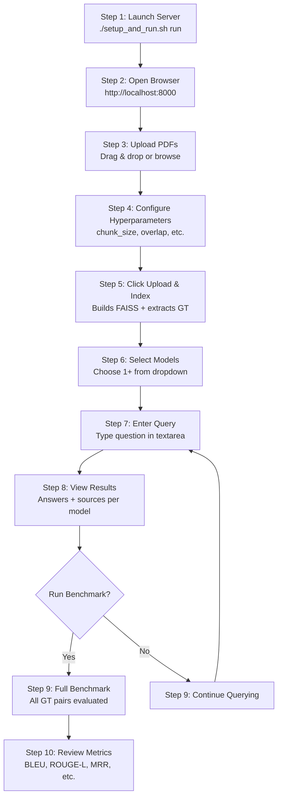

# RAG Benchmark PDF Data Extractor

## Academic Report — System Design, Architecture & Evaluation Framework

---

## 1. Abstract

This report presents the design and implementation of a **Retrieval-Augmented Generation (RAG) Benchmarking System** built as a FastAPI application. The system enables users to upload PDF documents, configure hyperparameters for text and image extraction, build FAISS vector indices, query multiple LLM models via OpenRouter, and evaluate response quality using established NLP benchmarking metrics. The architecture follows a modular pipeline pattern with separate components for extraction, embedding, retrieval, generation, and evaluation.

---

## 2. System Overview

The system is composed of six core modules operating in a sequential pipeline. A single bash script (`setup_and_run.sh`) provisions the entire environment — virtual environment, dependencies, directory structure, configuration, source code, and server launch.

### 2.1 High-Level Process Flow



---

## 3. Architecture Components

### 3.1 Component Interaction Diagram



### 3.2 Module Descriptions

| Module | File | Responsibility |
|--------|------|----------------|
| **Config** | `app/config.py` | Central configuration, environment variables, model registry |
| **PDF Processor** | `app/pdf_processor.py` | Text chunking, image extraction, table extraction, ground-truth mining |
| **Embeddings** | `app/embeddings.py` | Sentence-Transformer encoding, FAISS index build/query |
| **LLM Client** | `app/llm_client.py` | Async OpenRouter chat completion with latency tracking |
| **Benchmarks** | `app/benchmarks.py` | BLEU, ROUGE-L, Faithfulness, Context Precision/Recall, MRR, Hit Rate |
| **Main App** | `app/main.py` | FastAPI routes, session management, orchestration |
| **Frontend** | `app/templates/` + `app/static/` | HTML template, CSS styling, JavaScript client logic |

---

## 4. PDF Processing Pipeline

### 4.1 Extraction Flow



### 4.2 Configurable Hyperparameters

| Parameter | Default | Range | Applies To | Description |
|-----------|---------|-------|------------|-------------|
| `text_chunk_size` | 512 | 64–4096 | Text | Number of words per text chunk |
| `text_chunk_overlap` | 64 | 0–512 | Text | Overlapping words between consecutive chunks |
| `image_chunk_size` | 256 | 64–2048 | Images | Metadata chunk granularity |
| `top_k` | 5 | 1–50 | Retrieval | Number of chunks to retrieve |
| `cosine_threshold` | 0.0 | 0.0–1.0 | Reranking | Minimum cosine similarity to keep a chunk |
| `temperature` | 0.3 | 0.0–2.0 | Generation | LLM sampling temperature |

---

## 5. Embedding & Retrieval

### 5.1 Vector Index Pipeline



Key design decisions:

- **L2 normalization** of embeddings converts inner-product search to cosine similarity.
- **Over-retrieval** (2×top_k) followed by threshold filtering provides better precision.
- **Per-PDF indices** allow selective querying and independent updates.

---

## 6. LLM Integration via OpenRouter

### 6.1 Multi-Model Query Flow



### 6.2 Supported Models

| Provider | Model ID | Display Name |
|----------|----------|-------------|
| OpenAI | `openai/gpt-4o` | GPT-4o |
| OpenAI | `openai/gpt-4o-mini` | GPT-4o Mini |
| Anthropic | `anthropic/claude-sonnet-4` | Claude Sonnet 4 |
| Anthropic | `anthropic/claude-haiku-3.5` | Claude 3.5 Haiku |
| Google | `google/gemini-2.0-flash-001` | Gemini 2.0 Flash |
| Meta | `meta-llama/llama-3.3-70b-instruct` | Llama 3.3 70B |
| DeepSeek | `deepseek/deepseek-chat-v3-0324` | DeepSeek V3 |
| Mistral | `mistralai/mistral-large-2411` | Mistral Large |

---

## 7. Benchmarking Framework

### 7.1 Evaluation Metrics



### 7.2 Metric Definitions

| Metric | Category | Formula Summary | Range |
|--------|----------|-----------------|-------|
| **BLEU** | Lexical | Geometric mean of n-gram precisions (n=1..4) × brevity penalty | 0–1 |
| **ROUGE-L** | Lexical | LCS-based precision, recall, F1 between prediction and reference | 0–1 |
| **Faithfulness** | Semantic | \|answer_tokens ∩ context_tokens\| / \|answer_tokens\| | 0–1 |
| **Answer Relevancy** | Semantic | \|answer_tokens ∩ question_tokens\| / \|question_tokens\| | 0–1 |
| **Context Precision** | Retrieval | Average precision at relevant positions in top-k | 0–1 |
| **Context Recall** | Retrieval | \|reference_tokens ∩ retrieved_tokens\| / \|reference_tokens\| | 0–1 |
| **MRR** | Retrieval | 1 / rank of first relevant chunk (0 if none) | 0–1 |
| **Hit Rate** | Retrieval | 1 if any relevant chunk found, else 0 | 0 or 1 |

### 7.3 Ground Truth Extraction

The system automatically mines ground-truth Q&A pairs from uploaded PDFs using two heuristic strategies:

1. **Q&A pattern matching**: Regex detection of `Q: ... A: ...` or `Question: ... Answer: ...` patterns.
2. **Section heading analysis**: ALL-CAPS headings followed by substantial body text are converted to `"What is discussed under '<heading>'?"` → `<body text>` pairs.

---

## 8. API Reference

| Endpoint | Method | Description |
|----------|--------|-------------|
| `/` | GET | Serves the web UI |
| `/api/models` | GET | Lists available LLM models |
| `/api/sessions` | GET | Lists all active sessions |
| `/api/session/{id}` | GET | Returns full session data |
| `/api/upload` | POST | Upload PDFs, extract, index |
| `/api/query` | POST | Query RAG pipeline with multi-model |
| `/api/benchmark` | POST | Run full benchmark on ground-truth |
| `/api/chat_history/{id}` | GET | Returns chat history for session |

---

## 9. Directory Structure

```
rag-benchmark-system/
├── setup_and_run.sh          # One-command setup & launch
├── .env                      # API keys & config
├── app/
│   ├── __init__.py
│   ├── config.py             # Configuration
│   ├── pdf_processor.py      # PDF extraction
│   ├── embeddings.py         # Embedding & FAISS
│   ├── llm_client.py         # OpenRouter client
│   ├── benchmarks.py         # Evaluation metrics
│   ├── main.py               # FastAPI application
│   ├── templates/
│   │   └── index.html        # Web UI template
│   └── static/
│       ├── css/style.css     # Stylesheet
│       └── js/app.js         # Frontend logic
└── data/
    ├── uploads/              # Uploaded PDFs
    ├── indices/              # FAISS + PKL files
    ├── results/              # Benchmark results
    └── chats/                # Chat persistence
```

---

## 10. How to Run

### 10.1 Prerequisites

- Python 3.9 or higher
- An OpenRouter API key (get one at [https://openrouter.ai](https://openrouter.ai))
- ~2 GB disk space for models and dependencies

### 10.2 Quick Start

```bash
# 1. Clone or copy the project
cd rag-benchmark-system

# 2. Run the setup script (creates venv, installs deps, launches server)
chmod +x setup_and_run.sh
./setup_and_run.sh run

# 3. Open in browser
#    http://localhost:8000
```

### 10.3 Setup Only (without auto-launch)

```bash
./setup_and_run.sh setup

# Then manually activate and run:
source venv/bin/activate
export OPENROUTER_API_KEY="sk-or-v1-your-key"
python -m uvicorn app.main:app --host 0.0.0.0 --port 8000 --reload
```

### 10.4 Configuration

Edit `.env` to set your API key and preferences:

```env
OPENROUTER_API_KEY=sk-or-v1-your-key-here
OPENROUTER_BASE_URL=https://openrouter.ai/api/v1
EMBEDDING_MODEL=all-MiniLM-L6-v2
HOST=0.0.0.0
PORT=8000
```

---

## 11. End-to-End Workflow



---

## 12. Additional Changes & Enhancements

The following table lists all changes and enhancements made beyond the original requirements:

| # | Change | Rationale | Component |
|---|--------|-----------|-----------|
| 1 | Added table extraction alongside text/images | Tables contain structured data critical for academic PDFs | `pdf_processor.py` |
| 2 | Implemented sliding-window chunking with configurable overlap | Overlap prevents information loss at chunk boundaries | `pdf_processor.py` |
| 3 | Added automatic ground-truth extraction from PDFs | Enables automated benchmarking without manual annotation | `pdf_processor.py` |
| 4 | Used L2-normalized embeddings with inner-product search | Equivalent to cosine similarity but faster in FAISS | `embeddings.py` |
| 5 | Over-retrieve (2×top_k) then filter by cosine threshold | Improves precision without sacrificing recall | `embeddings.py` |
| 6 | Added per-PDF index files for independent management | Allows adding/removing documents without full reindex | `embeddings.py` |
| 7 | Implemented 8 distinct evaluation metrics | Covers lexical, semantic, and retrieval quality dimensions | `benchmarks.py` |
| 8 | Added aggregate benchmark with min/mean/max statistics | Provides distributional view of model performance | `main.py` |
| 9 | Added session management with unique IDs | Enables multiple concurrent users and experiment tracking | `main.py` |
| 10 | Implemented chat history persistence in sidebar | Users can revisit and compare past queries | `app.js` |
| 11 | Added drag-and-drop file upload | Improves UX for batch uploads | `app.js` |
| 12 | Made UI fully responsive (mobile/tablet/desktop) | Accessible on all devices for field research | `style.css` |
| 13 | Added keyboard shortcut (Enter to send query) | Faster interaction for power users | `app.js` |
| 14 | Added latency tracking for all LLM calls | Important metric for benchmarking real-world performance | `llm_client.py` |
| 15 | Added token usage reporting from OpenRouter | Enables cost analysis across models | `llm_client.py` |
| 16 | Included source citations in LLM system prompt | Forces models to ground responses in retrieved context | `main.py` |
| 17 | Created single bash script for full provisioning | Zero-friction setup for reproducibility | `setup_and_run.sh` |
| 18 | Added `.env` template auto-generation | Prevents accidental API key exposure in source code | `setup_and_run.sh` |
| 19 | Context Precision uses weighted average precision | More informative than simple binary relevance | `benchmarks.py` |
| 20 | Added reference answer display alongside benchmarks | Enables manual verification of automated metrics | `main.py` |

---

## 13. Limitations & Future Work

- **Ground-truth extraction** relies on heuristics; manually curated Q&A pairs would improve benchmark reliability.
- **Image understanding** currently stores metadata only; integration with vision-language models (e.g., GPT-4o vision) would enable true multimodal RAG.
- **BERTScore** is implemented as a dependency but not yet wired into the evaluation loop due to computational cost; it can be enabled for smaller evaluation sets.
- **Concurrent model querying** is sequential; async parallel dispatch would reduce total latency for multi-model comparisons.
- **Persistence** uses in-memory session storage; a database (SQLite/PostgreSQL) would enable durability across server restarts.

---

## 14. References

1. Lewis, P. et al. (2020). *Retrieval-Augmented Generation for Knowledge-Intensive NLP Tasks*. NeurIPS.
2. Papineni, K. et al. (2002). *BLEU: A Method for Automatic Evaluation of Machine Translation*. ACL.
3. Lin, C.Y. (2004). *ROUGE: A Package for Automatic Evaluation of Summaries*. ACL Workshop.
4. Zhang, T. et al. (2020). *BERTScore: Evaluating Text Generation with BERT*. ICLR.
5. Es, S. et al. (2024). *RAGAS: Automated Evaluation of Retrieval Augmented Generation*. EACL.
6. Johnson, J. et al. (2019). *Billion-scale Similarity Search with GPUs*. IEEE Big Data.

---

*Report generated for academic evaluation purposes. System version 1.0.0.*
